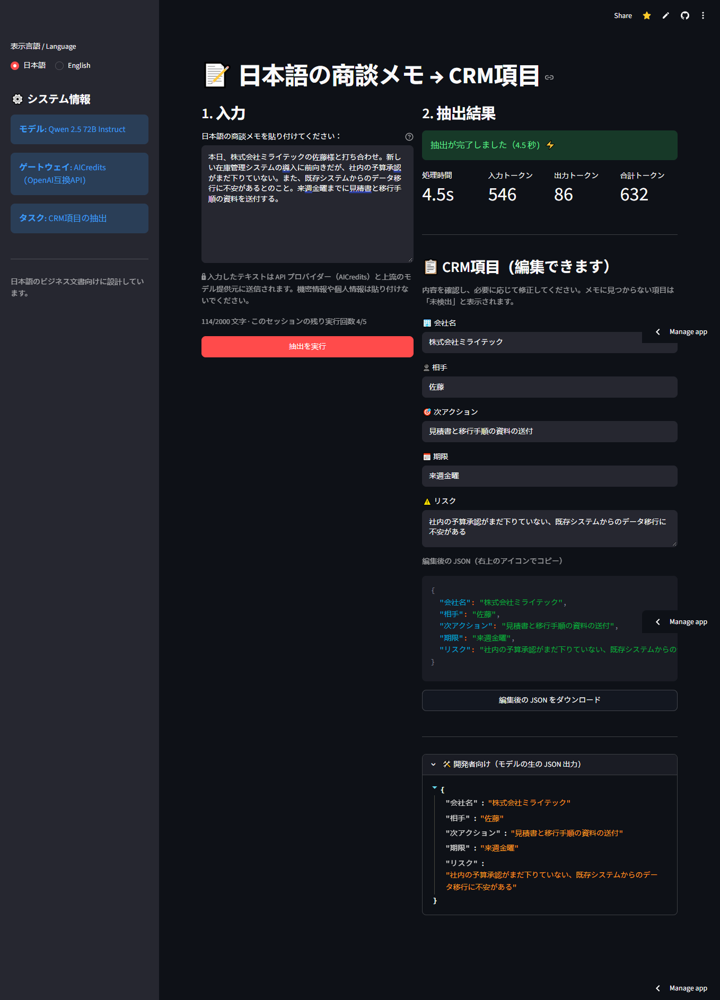

[English README](README.md)

# jp-meeting-to-crm-fields

日本語の商談メモから、CRM入力に必要な項目を JSON で抽出するツールです。

## 概要

営業担当者が商談後に書いたメモを貼り付けると、CRM への入力に必要な次の 5 項目を抽出します。

- **会社名**
- **相手**（先方担当者）
- **期限**
- **次アクション**
- **リスク**

商談メモから CRM への転記作業を減らすことが目的です。モデルは Qwen 2.5 72B Instruct を使用し、OpenAI 互換 API（AICredits 経由）で呼び出しています。

## デモ

デモサイト: https://retro-jp-meeting-to-crm-fields.streamlit.app/



- 一定時間アクセスがないとスリープ状態になります。画面のボタンを押すと起動します。
- 入力は 2,000 文字まで、実行は 1 セッションあたり 5 回までです。全体で 1 日の実行上限もあります。
- 入力したテキストは API プロバイダー（AICredits）と上流のモデル提供元に送信されます。機密情報や個人情報は貼り付けないでください（アプリの入力欄の近くにも同じ注意を表示しています）。
- 画面は日本語（初期表示）と英語を切り替えられます。抽出した 5 項目は画面上で編集でき、編集後の値を JSON としてコピー・ダウンロードできます。メモに情報がない項目は「未検出」と表示されます。

## 評価結果

LLM で生成した 30 件の合成商談メモで評価しました（実顧客データ・実際の面談データは使用していません）。2026-10-02 に temperature=0 で測定しています（GitHub Actions で 1 回実行、[run 36997123093](https://github.com/Retro099/jp-meeting-to-crm-fields/actions/runs/36997123093)）。詳細は [eval/results.md](eval/results.md) をご覧ください。別途、「未検出」の確認用に、1〜2 項目が欠けた **合成** メモ 5 件（`data/missing_5.jsonl`、欠けた項目の正解は「未検出」）も用意しました。30 件の固定評価セットとは別に集計しています。

全体の完全一致率（150 項目）: 28.7% → 53.3% → 56.0%（temperature=0 設定前） → 59.3%（89/150、temperature=0） → **60.0%**（90/150、「未検出」ルール追加後）

| 項目 | 完全一致 | LLM-judge (semantic) |
|---|---|---|
| 相手 | 100%（30/30） | — |
| 会社名 | 96.7%（29/30） | — |
| 期限 | 80.0%（24/30） | — |
| 次アクション | 23.3%（7/30） | 88.5%（match 20 / partial 6 / miss 0、26 件） |
| リスク | 0.0%（0/30） | 65.4%（match 8 / partial 18 / miss 0、26 件） |

- 次アクションとリスクは自由記述のため、完全一致に加えて LLM による意味ベースの評価（match=1、partial=0.5、miss=0）も行いました。
- 今回は判定 60 回のうち 8 回（メモ 26〜30）が上流プロバイダーの HTTP 429 で失敗したため、判定の列は各 26 件です。前回（次アクション 91.7%、リスク 75.0%）より低いものの、対象件数が異なる 1 回の実行のため、そのまま比較はできません。
- 評価に使うモデルは抽出と同じ Qwen 2.5 72B のため、自己評価バイアスがあります。
- AIによるスポットチェック（全60件）。作者による手動確認は実施予定です。対象は前回（イテレーション 4）の判定で、一致は 53/60（88%）、不一致の 7 件はいずれも判定が甘いケースでした（[確認結果](eval/judge_spotcheck.md)）。今回の判定には実施していません。
- 前回（59.3%）からの差は +0.7 ポイント（1 項目）です。会社名が 28/30 → 29/30（メモ 29 が `ファーストステップ合同会社` で正解）。期限は 24/30 のままで、メモ 13 が正解（`明日中`）になった一方、メモ 9 は `今週金曜18時` → `今週中（金曜18時）` と悪化しました。どちらも 30 件・1 回の実行のため、1 項目の差は実行ごとのばらつきの範囲です。
- gold_30 では「未検出」の誤出力は 0/150 でした。
- 「未検出」確認セット（合成 5 件）: 欠けた項目を「未検出」と出力できたのは 6/7、値がある項目を誤って「未検出」としたのは 0/18、全項目の完全一致は 18/25 でした。外れた 1 件はメモ 4 の次アクション（「今回は情報交換のみ」）で、「未検出」ではなく `情報交換` と出力しました。件数が少ないため、目安としてご覧ください。
- コストと処理時間（実測）: 抽出は gold_30 が 30 回で 18,453 トークン、約 ₹0.71（1 件あたり約 ₹0.02）、平均 8.9 秒/件、missing_5 が 5 回で 2,970 トークン、約 ₹0.11 です。判定は 60 回（うち 8 回失敗）で 31,487 トークン、約 ₹1.21 です。合計は約 ₹2.03 です。処理時間は前回（4.6 秒/件）より長くなりました。429 エラーと同じ上流の混雑が関係している可能性がありますが、調べていません。

### 主な失敗例

1. **言い換えが不一致扱い**: リスク（メモ 1）`予算取りが難航している` → `予算取りの難航`。意味は同じで、判定は match です。
2. **2 つ目のリスクの抜け**: リスク（メモ 5）`現状の運用フローへの不満、解約の可能性` → `解約の可能性`。
3. **期限の表記ゆれ**: 期限（メモ 25）`今週水曜の午前中` → `今週水曜の午前`。`明日中` → `明日` も 2 件（メモ 10、30）ありました。メモ 9 では `今週金曜18時` → `今週中（金曜18時）` と余計な語が入りました。
4. **会社名のルール違反**: メモ 21 の `(同)オメガパートナーズ` が `オメガパートナーズ` になりました（正解は `合同会社オメガパートナーズ`）。missing_5 のメモ 2 では `さくら物流(株)` が `株式会社さくら物流` となり、法人格の位置が変わっています。
5. **「未検出」とせずに推測**: missing_5 のメモ 4 は次アクションがない（「今回は情報交換のみ」）にもかかわらず、`情報交換` と出力しました。

## 使い方

```bash
git clone https://github.com/Retro099/jp-meeting-to-crm-fields.git
cd jp-meeting-to-crm-fields
pip install -r requirements.txt
# .env に AICREDITS_API_KEY=... を記載
streamlit run app.py
```

テストは `pip install -r requirements-dev.txt` の後に `pytest -q` で実行できます（API キー不要）。

Docker でも起動できます。手順は [README.md](README.md) をご覧ください。

## 制約・今後の改善

- 完了: 次アクション・リスクの意味ベース評価、コストと処理時間の実測、テストと CI の整備
- 判定モデルを抽出モデルと別にする、または日本語話者が判定を確認する
- 失敗例に基づくプロンプト改善（期限の「中」を残す、リスクをすべて列挙する、法人格の位置を保つ、「(同)」を展開する）。イテレーション 5 では「未検出」ルールのみ追加し、これらは未対応です
- 完了: 抽出結果の画面上での編集と JSON のコピー・ダウンロード、見つからない項目の「未検出」表示、日本語／英語の表示切り替え

## 作者

Prithivi Raj Mohanta
