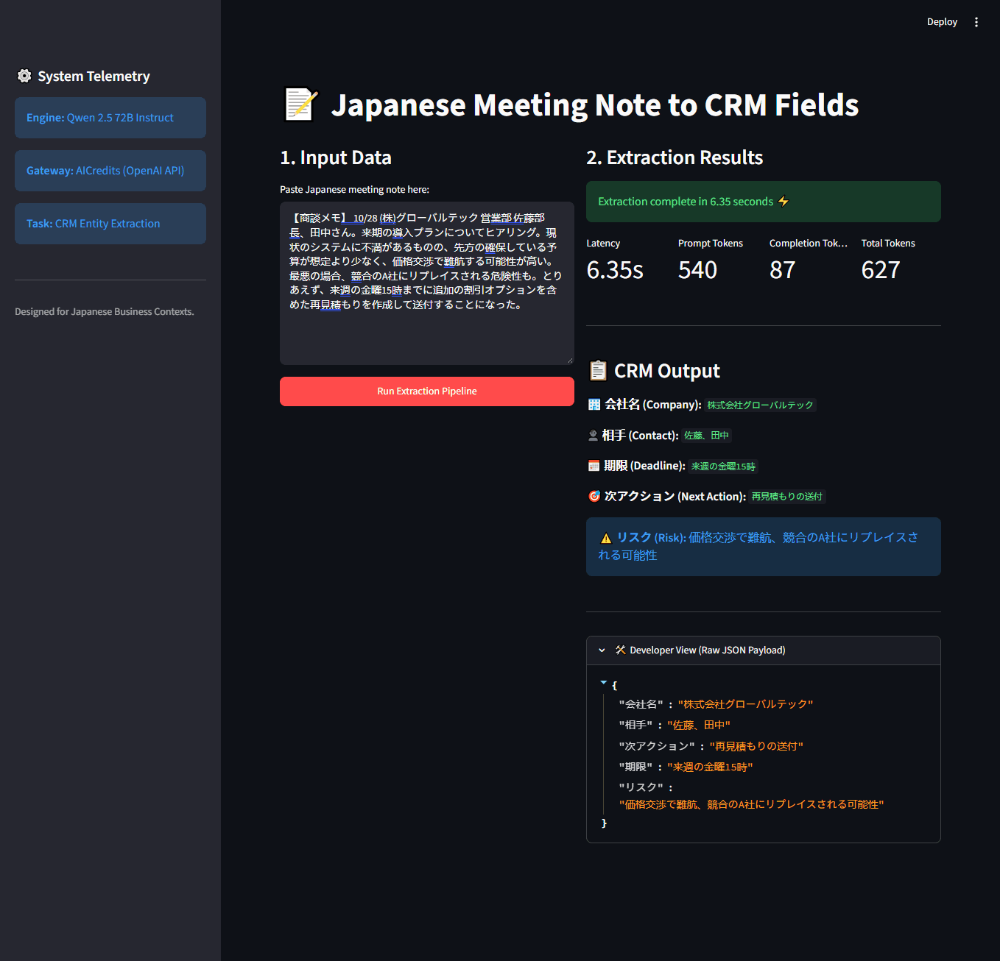

[English README](README.md)

# jp-meeting-to-crm-fields

日本語の商談メモから、CRM入力に必要な項目を JSON で抽出するツールです。

## 概要

営業担当者が商談後に書いたメモを貼り付けると、CRM への入力に必要な次の 5 項目を抽出します。

- **会社名**
- **相手**（先方担当者）
- **期限**
- **次アクション**
- **リスク**

商談メモから CRM への転記作業を減らすことが目的です。モデルは Qwen 2.5 72B Instruct を使用し、OpenAI 互換 API（AICredits 経由）で呼び出しています。

## デモ

デモサイト: https://retro-jp-meeting-to-crm-fields.streamlit.app/



- 一定時間アクセスがないとスリープ状態になります。画面のボタンを押すと起動します。
- 入力は 2,000 文字まで、実行は 1 セッションあたり 5 回までです。全体で 1 日の実行上限もあります。

## 評価結果

LLM で生成した 30 件の合成商談メモで評価しました（実顧客データ・実際の面談データは使用していません）。判定は完全一致です。

プロンプト改善による全体の一致率: 28.7% → 53.3% → **56.0%**（84/150）

| 項目 | 一致率 |
|---|---|
| 相手 | 100% |
| 会社名 | 93.3% |
| 期限 | 70.0% |
| 次アクション | 13.3% |
| リスク | 3.3% |

次アクションとリスクは自由記述の項目のため、完全一致ではスコアが低くなります。不一致の多くは言い換えですが、内容が欠けているケースもあります。意味ベースの評価は今後実施予定です。

※ 上記の結果は temperature=0 に設定する前のものです。

## 使い方

```bash
git clone https://github.com/Retro099/jp-meeting-to-crm-fields.git
cd jp-meeting-to-crm-fields
pip install -r requirements.txt
# .env に AICREDITS_API_KEY=... を記載
streamlit run app.py
```

Docker でも起動できます。手順は [README.md](README.md) をご覧ください。

## 制約・今後の改善

- 次アクション・リスクの意味ベース評価
- 抽出結果を画面上で編集できるようにする（見つからない項目は「未検出」と表示）
- メモ 1 件あたりのコストと処理時間を実測する
- テストと CI の整備

## 作者

Prithivi Raj Mohanta
