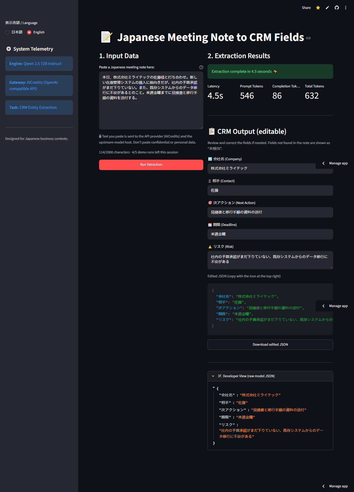

[](https://github.com/Retro099/jp-meeting-to-crm-fields/actions/workflows/ci.yml)

[日本語版はこちら](README.ja.md)

# JP Meeting Note to CRM Fields Extractor

日本語の商談メモからCRM項目（相手・会社名・期限・次アクション・リスク）をLLMで抽出し、正解データで精度を評価するプロジェクトです。

**▶ Live demo: https://retro-jp-meeting-to-crm-fields.streamlit.app/**<br>
*It may be asleep if no one has used it recently. Click the wake-up button and wait a moment. Demo limits apply (see below).*

LLM extraction of CRM fields from unstructured Japanese business meeting notes, with a fixed 30-note exact-match evaluation. The prompt is designed for common patterns in Japanese business notes—corporate abbreviations, honorifics, and informal formatting—and uses Qwen 2.5 72B Instruct to return the fields as JSON.

The project includes a Streamlit frontend (runnable in Docker) that shows the extracted fields, request latency, and token usage for each run.

## 🎯 Why / Who it's for
Sales reps write quick, messy notes after a customer call, and then have to re-type the key facts into the CRM by hand. With this tool, a rep pastes the Japanese meeting note, gets the five CRM fields (相手・会社名・期限・次アクション・リスク) back as JSON, reviews and corrects them, and then saves them to the CRM. The aim is to cut manual CRM data entry; the time saved has not been measured.

**Demo limits:** to protect the API budget, the hosted demo allows at most 2,000 characters per note, 5 runs per visitor session, and a shared daily cap on total runs.

**Privacy:** text you paste is sent to the API provider (AICredits) and the upstream model host, so don't paste confidential or personal data. The app shows the same note next to the input box.

## 🏗️ Architecture & Tech Stack
* **LLM Engine:** Qwen 2.5 72B Instruct
* **API Gateway:** AICredits (OpenAI SDK compatible, enabling cost-effective and region-unlocked model access)
* **Frontend UI:** Streamlit with a Japanese/English toggle (Japanese by default). The five fields are shown as editable inputs (`未検出` when the note has no value), and the edited values can be copied or downloaded as JSON. Latency, token usage, and the raw model JSON are shown too.
* **Deployment:** Docker (`python:3.11-slim`) for local runs; Streamlit Community Cloud for the hosted demo.
* **Evaluation:** Custom Python evaluation loop for exact-match validation against a gold-standard dataset.

## 🧠 Japanese NLP & Prompt Engineering
Extracting data from Japanese business notes requires handling specific linguistic edge cases. The prompt architecture was iteratively engineered to enforce:
1. **Entity Standardization:** Automatically converting corporate shorthand (e.g., `(株)`, `(有)`) to formal legal entities (`株式会社`, `有限会社`) while preserving prefix/suffix positioning.
2. **Honorific Stripping:** Removing departmental noise and titles (`様`, `さん`, `社長`, `部長`) to isolate raw contact names.
3. **Nominal Phrase Formatting (体言止め):** Transforming conversational next-action verbs into professional, concise noun phrases.
4. **Temporal Normalization:** Stripping conversational suffixes (e.g., `まで`) from deadlines to ensure strict CRM date-string compliance.
5. **Missing fields (未検出):** if a field is truly absent from the note, the model must output exactly `未検出` instead of guessing. The app and eval also turn a missing key, null, or blank value into `未検出`.

## 📊 Evaluation Metrics
The pipeline is evaluated against a 30-note labeled dataset (`data/gold_30.jsonl`) with a strict exact-string match, plus an LLM-as-judge semantic score for the two free-text fields.

*Data note:* the 30 evaluation notes (`data/gold_30.jsonl`) are synthetic, LLM-generated Japanese business meeting notes with gold labels prepared for this eval; no real customer or interview data is used. `data/missing_5.jsonl` is a separate, **synthetic** set of 5 notes written for the `未検出` check, each missing 1–2 fields (gold label `未検出`). It is not part of the frozen 30-note score.

Measured at temperature=0 on 2026-10-02 (single run on GitHub Actions, [run 36997123093](https://github.com/Retro099/jp-meeting-to-crm-fields/actions/runs/36997123093), same prompt and model as the app). Full details and per-note failure logs: [`eval/results.md`](eval/results.md).

### Results

Overall exact-match accuracy on 150 fields (30 notes × 5 fields), by iteration:

| Iteration | Exact match (150 fields) |
| :--- | :--- |
| Iteration 1 | 28.7% |
| Iteration 2 | 53.3% |
| Iteration 3, before temperature=0 ([details](eval/results_pre_t0.md)) | 56.0% (84/150) |
| Iteration 4, same prompt at temperature=0 ([details](https://github.com/Retro099/jp-meeting-to-crm-fields/blob/ed59caf/eval/results.md)) | 59.3% (89/150) |
| Iteration 5, 未検出 rule added to the prompt, temperature=0 (current) | **60.0%** (90/150) |

Per-field results (iteration 5, temperature=0):

| Field (抽出項目) | Exact match | Correct/Total | LLM-judge (semantic) | LLM-judge strict (match only) |
| :--- | :--- | :--- | :--- | :--- |
| **Contact (相手)** | 100.0% | 30/30 | — | — |
| **Company (会社名)** | 96.7% | 29/30 | — | — |
| **Deadline (期限)** | 80.0% | 24/30 | — | — |
| **Action (次アクション)** | 23.3% | 7/30 | 88.5% (20 match / 6 partial / 0 miss, 26 judged) | 76.9% (20/26) |
| **Risk (リスク)** | 0.0% | 0/30 | 65.4% (8 match / 18 partial / 0 miss, 26 judged) | 30.8% (8/26) |
| **Overall** | **60.0%** | **90/150** | | |

*Exact match* compares the strings after trimming whitespace. *LLM-judge (semantic)* covers only `次アクション` and `リスク`: the same model grades each prediction against the gold answer (`eval/judge.py`, prompt in `eval/judge_prompt.txt`, temperature 0) as match = 1, partial = 0.5, miss = 0. The strict column counts `match` only.

**Judge calls failed in this run:** 8 of the 60 judge calls (notes 26–30) failed with HTTP 429 from the upstream provider, so each judge column covers 26 notes, not 30. The judge scores are lower than in iteration 4 (次アクション 91.7% → 88.5%, リスク 75.0% → 65.4%), but they cover different notes and are single runs, so they are not directly comparable.

**How far to trust the judge:**
- The judge is the same model family as the extractor, so expect some self-judging bias.
- An AI-assisted spot-check (all 60 verdicts); manual verification by the author is pending ([`eval/judge_spotcheck.md`](eval/judge_spotcheck.md)). It covers the iteration 4 verdicts and agreed with 53/60 (88%). All 7 disagreements were the judge being too lenient. It was not repeated for iteration 5.
- With the spot-check verdicts, the iteration 4 scores would be 81.7% (次アクション) and 73.3% (リスク).

**Compared with iteration 4:** +0.7 points (+1 field). 会社名 went from 28/30 to 29/30 (note 29 now keeps `ファーストステップ合同会社`). 期限 stayed at 24/30: note 13 is now right (`明日中`), but note 9 got worse (`今週金曜18時` → `今週中（金曜18時）`). 相手, 次アクション and リスク have the same counts. The model predicted `未検出` for 0 of the 150 gold_30 fields, so the new rule did not cause false "not found" answers there. Both results are single runs on 30 notes, so a one-field difference is within run-to-run variation.

**Missing-field check (`data/missing_5.jsonl`, 5 synthetic notes, each missing 1–2 fields):**

| Measure | Result |
| :--- | :--- |
| Absent fields correctly output as `未検出` | 6/7 |
| Present fields wrongly output as `未検出` | 0/18 |
| Exact match, all fields | 18/25 |

The one miss: note 4 has no next action (「今回は情報交換のみ」), but the model output `情報交換` instead of `未検出`. The set is very small, so treat it as a sanity check, not an accuracy figure.

**Cost and latency (measured in this run):**

| Run | API calls | Tokens (prompt + completion) | Est. cost | Avg latency |
| :--- | :--- | :--- | :--- | :--- |
| Extraction (gold_30) | 30 | 18,453 (16,332 + 2,121) | ≈ ₹0.71 (≈ ₹0.02 per note) | 8.9 s per note |
| Extraction (missing_5) | 5 | 2,970 (2,637 + 333) | ≈ ₹0.11 | 6.2 s per note |
| LLM judge | 60 (8 failed) | 31,487 (29,826 + 1,661) | ≈ ₹1.21 | 13.08 s per call |

Total for the run: ≈ ₹2.03. *The cost estimate uses the upstream rate of $0.36/M input and $0.40/M output tokens, plus the AICredits 5% forex buffer and 5% platform fee, at USD/INR 96.06. Failed calls report no tokens. The exact amount charged is shown in the AICredits dashboard.* Latency was higher than in iteration 4 (4.6 s per note), possibly related to the upstream load that also caused the 429 errors; this was not investigated.

### Failure analysis

Five representative misses from the iteration 5 run (gold → predicted):

1. **Correct paraphrase counted as wrong (exact-match limitation).** Note 1 リスク: `予算取りが難航している` → `予算取りの難航`. Same meaning in noun form; the judge says `match`. This is why リスク scores 0/30 on exact match: the gold labels mix sentence and noun styles, and no prediction matches them character-for-character.
2. **Second risk missing.** Note 5 リスク: `現状の運用フローへの不満、解約の可能性` → `解約の可能性`. The model often keeps only the most serious risk.
3. **Deadline wording slip.** Note 25 期限: `今週水曜の午前中` → `今週水曜の午前`. A smaller version of the same slip: `明日中` → `明日` (notes 10, 30). Note 9 added text: `今週金曜18時` → `今週中（金曜18時）`.
4. **Company-name rule broken.** In note 21, `(同)オメガパートナーズ` gives `オメガパートナーズ`, where the gold is `合同会社オメガパートナーズ`. In missing_5 note 2, `さくら物流(株)` gives `株式会社さくら物流`: the legal-entity position moved to the front, which the prompt forbids.
5. **Guess instead of `未検出`.** missing_5 note 4 has no next action (「今回は情報交換のみ」), but the model output `次アクション: 情報交換` instead of `未検出`.



*The live deployed app (Streamlit Community Cloud) on a fictional sample note, showing latency/token telemetry, the demo-limit counter, and the raw JSON output.*

## 📂 Repository Structure
```text
├── .github/workflows/
│   ├── ci.yml                 # CI: pytest on Python 3.11 (no network, no secrets)
│   └── eval.yml               # Manual eval run (workflow_dispatch, uses the AICREDITS_API_KEY secret)
├── data/
│   ├── gold_30.jsonl          # 30-note labeled evaluation dataset (frozen)
│   └── missing_5.jsonl        # 5 synthetic notes with 1–2 missing fields (gold 未検出)
├── docs/
│   ├── screenshot_en.png      # Live app, English UI (fictional sample note)
│   └── screenshot_ja.png      # Live app, Japanese UI (fictional sample note)
├── eval/
│   ├── run_eval.py            # Runs the extraction on a labelled set, saves predictions + run metadata
│   ├── judge.py               # LLM-as-judge (semantic) scoring for 次アクション and リスク
│   ├── judge_prompt.txt       # Judge prompt (Japanese/English, JSON output)
│   ├── scoring.py             # Exact-match and judge-verdict scoring (pure functions)
│   ├── report.py              # Builds results.md from the saved files (no API calls)
│   ├── predictions_t0.jsonl   # Per-note predictions at temperature=0
│   ├── run_meta_t0.json       # Run date, calls, tokens, avg latency (extraction)
│   ├── judge_results.jsonl    # Per-field judge verdicts and reasons
│   ├── judge_meta.json        # Judge calls, tokens, latency and summary
│   ├── judge_spotcheck.md     # AI-assisted check of all 60 judge verdicts (author check pending)
│   ├── results.md             # Current results, cost/latency, failure logs
│   └── results_pre_t0.md      # History: iteration 3 results before temperature=0
├── tests/                     # pytest unit tests + Streamlit AppTest smoke tests (mocked client, no API key needed)
├── .dockerignore              # Docker build exclusions
├── .gitignore                 # Enforces security exclusions (.env, pycache)
├── Dockerfile                 # Container definition (Exposes port 8501)
├── README.md                  # Project documentation
├── README.ja.md               # Japanese README (日本語版)
├── app.py                     # Streamlit frontend with API telemetry and demo limits
├── demo_limits.py             # Input-length check and per-session / daily run caps
├── extractor.py               # The extraction API call + JSON parsing (used by app + eval)
├── prompts.py                 # Shared system prompt, model name and settings (used by app + eval)
├── ui_strings.py              # UI text in Japanese (default) and English
├── pytest.ini                 # pytest settings
├── requirements.txt           # Minimal pinned runtime dependencies
└── requirements-dev.txt       # Test dependencies (pytest)
```

## 🚀 Quick Start (Local Deployment)

### Prerequisites

* Docker Desktop installed (with WSL2 configured for Windows users).
* An active AICredits API key.

### 1. Environment Setup

Clone the repository and create a `.env` file in the root directory to securely inject your API credentials:

```env
AICREDITS_API_KEY="your_actual_key_here"

```

### 2. Build the Docker Image

Construct the lightweight Python container:

```bash
docker build -t jp-crm-extractor .

```

### 3. Run the Application

Launch the container, mapping the Streamlit port and injecting the environment variables:

```bash
docker run --rm --name jp-crm-app -p 8501:8501 --env-file .env jp-crm-extractor

```

*(The `--rm` flag ensures the container automatically cleans itself up when stopped, preventing disk bloat).*

### 4. Access the UI

Navigate to `http://localhost:8501` in your web browser. Paste a Japanese meeting note into the input panel and execute the pipeline to view the structured CRM output, execution latency, and token economy metrics.

## 🧪 Tests and re-running the eval

Unit tests use a mocked API client, so they need no network and no API key:

```bash
pip install -r requirements.txt -r requirements-dev.txt
pytest -q
```

GitHub Actions runs the same tests on every push and pull request to `main` (Python 3.11).

To re-run the eval (95 API calls in total), set `AICREDITS_API_KEY` in your environment and run:

```bash
python eval/run_eval.py   # 30 extraction calls -> eval/predictions_t0.jsonl
python eval/run_eval.py --data data/missing_5.jsonl --tag missing5   # 5 calls -> eval/predictions_missing5.jsonl
python eval/judge.py      # 60 judge calls      -> eval/judge_results.jsonl
python eval/report.py     # no API calls        -> eval/results.md
```

The repo owner can also run this on GitHub Actions: **Actions → Eval (manual, uses API credits) → Run workflow**. The workflow reads the `AICREDITS_API_KEY` repository secret, stops if more than 100 calls are planned, and uploads the outputs as an artifact.

## ☁️ Deploy on Streamlit Community Cloud

1. At [share.streamlit.io](https://share.streamlit.io), click **Create app** and pick this repository, branch `main`, and main file path `app.py`.
2. Open **Advanced settings**, choose **Python 3.11** (the same version as the Docker image), and paste this into **Secrets**:

   ```toml
   AICREDITS_API_KEY = "your_actual_key_here"
   ```
3. Click **Deploy**. The app reads the key from the environment first and falls back to `st.secrets`. If the key is missing, the app shows setup instructions instead of the UI.

Community Cloud installs the pinned packages from `requirements.txt`. Apps with no traffic for 12 hours go to sleep; any visitor can wake one up from the sleep page.

## 🔭 Limitations & future work

- Done: semantic (LLM-as-judge) scoring for `次アクション` and `リスク`; measured cost and latency per note; unit tests and CI.
- The judge is the same model family as the extractor and was lenient in the spot-check. A different judge model, or a review by a Japanese-speaking domain expert, would make the semantic scores more reliable.
- Prompt fixes suggested by the failure analysis: keep `中` in deadlines (`明日中`, `午前中`), list every risk, keep the legal-entity position, and expand `(同)`. Iteration 5 only added the `未検出` rule; these fixes are not done yet.
- The eval set is small (30 synthetic notes), so a few notes change the score by several points.
- Done: editable fields in the UI with JSON copy/download, `未検出` for missing fields, and a Japanese/English UI toggle.
